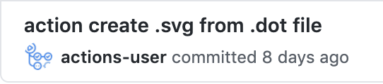

# Digraph to SVG Github Action

Digraph to SVG runs [graphviz](https://graphviz.org/) to compile [DOT (graph description language)](<https://en.wikipedia.org/wiki/DOT_(graph_description_language)>) files which can be maintained by a person into svg
files that can be displayed by a browser.

1. Install it as a [Github Action](https://github.com/features/actions)
2. Check in a digraph dot file named with the `.dot` extension
3. This action will create and commit a `.svg` file in the same directory with the base name (ie `my-graph.dot` -> `my-graph.svg`)

## An example

If you want this action to run on every pull request that changes a `*.dot` file create the following in your project as `.github/workflows/main.yml`

```
on:
  pull_request:
    paths:
      - "**.dot"

jobs:
  digraph_to_svg_job:
    runs-on: ubuntu-latest
    name: Create svg image from digraph .dot file
    steps:
      - uses: actions/checkout@v2
        with:
          ref: ${{ github.head_ref }}
      - name: Digraph to SVG step
        id: digraph_to_svg
        uses: alexrothenberg/digraph-to-svg-action@master
```

When you create a pull request that adds or updates a `.dot` file like [example/graph.dot](example/graph.dot) the action will run and you'll see a new commit from `actions-user` in your pull adding [example/graph.svg](example/graph.svg) like



# How it works

- The [Dockerfile](Dockerfile) installs graphviz in this action
- [entrypoint.sh](entrypoint.sh)
  - scans for files `.dot` files and runs graphviz to generate a `.svg` for each
  - commits the changes back into the branch of your github repo that triggered the action

# Contributing

Contributions are welcome as github pull requests at https://github.com/alexrothenberg/digraph-to-svg-action

# License

Licensed under MIT License. See [LICENSE](LICENSE) for more details.
